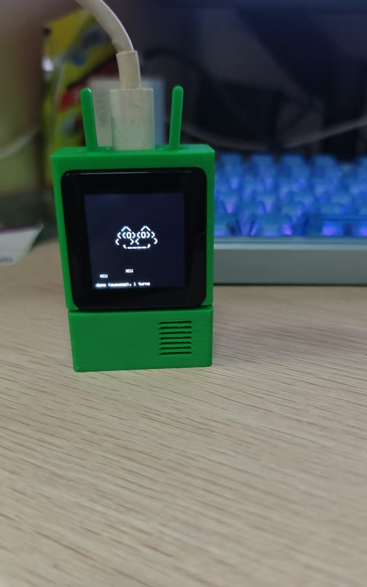

# Claude Desktop Buddy — RootMaker Edition

[中文版本](README_CN.md)

A port of Anthropic's [claude-desktop-buddy](https://github.com/anthropics/claude-desktop-buddy) to the **Ryzobee RootMaker** development board (ESP32-S3).

The original project targets the M5StickC Plus. This version replaces the board-specific drivers with the Ryzobee BSP while keeping the application logic intact, and replaces the original's buzzer with a **CI1302 audio chip** that supports both pre-stored audio files (triggered by ID) and real-time PCM streaming — enabling much richer sound feedback.



---

## Hardware

| Component | Details |
|-----------|---------|
| MCU | Ryzobee RootMaker (ESP32-S3) |
| Display | 240×240 ST7789 SPI LCD (LovyanGFX) |
| Touch | CST816T |
| IMU | LIS2DWTR / LIS2DW12 (3-axis accelerometer) |
| LED | WS2812B RGB (GPIO 45) |
| Speaker | CI1302 audio chip (UART, TX GPIO 37 / RX GPIO 36) |
| Button | Single button on GPIO 0 |

---

## What's Different from the Original

- **Board**: Ryzobee RootMaker (ESP32-S3) instead of M5StickC Plus
- **Display**: 240×240 (square) instead of 135×240
- **Speaker**: CI1302 audio chip supports both **built-in pre-stored audio** (playable by ID, e.g. `cmd_1.mp3` ~ `cmd_4.mp3`) and **real-time PCM streaming** (synthesized waveforms) — richer than the original's buzzer
- **Button**: Single-button layout (short press / long press) instead of two buttons
- **BSP**: Uses the [Ryzobee Arduino library](https://github.com/Ryzobee/Ryzobee_arduino_esp32) for hardware abstraction

---

## Dependencies

Install these libraries in Arduino IDE before compiling:

| Library | Min Version | Source |
|---------|-------------|--------|
| arduino-esp32 | ≥ 3.3.7 | [espressif/arduino-esp32](https://github.com/espressif/arduino-esp32) |
| Ryzobee | latest | [Ryzobee/Ryzobee_arduino_esp32](https://github.com/Ryzobee/Ryzobee_arduino_esp32) |
| LovyanGFX | ≥ 1.2.19 | [lovyan03/LovyanGFX](https://github.com/lovyan03/LovyanGFX) |
| Adafruit NeoPixel | ≥ 1.12.3 | [adafruit/Adafruit_NeoPixel](https://github.com/adafruit/Adafruit_NeoPixel) |
| LIS2DW12 | ≥ 2.1.1 | [stm32duino/LIS2DW12](https://github.com/stm32duino/LIS2DW12) |
| AnimatedGIF | ≥ 2.2.0 | [bitbank2/AnimatedGIF](https://github.com/bitbank2/AnimatedGIF) |

---

## Arduino IDE Configuration

Select the board in Arduino IDE with these settings:

| Setting | Value |
|---------|-------|
| Board | RootMaker (via Ryzobee board package) |
| Flash Mode | QIO 80MHz |
| Flash Size | 16MB |
| PSRAM | QSPI PSRAM |

---

## Building & Flashing

1. Install all dependencies listed above.
2. Add the Ryzobee board package URL to Arduino IDE preferences.
3. Open `cc_hardware_buddy.ino`.
4. Select the RootMaker board and configure the settings above.
5. Click **Upload**.

---

## Pairing with Claude

1. Enable developer mode in Claude desktop: **Help → Troubleshooting → Enable Developer Mode**
2. Open: **Developer → Open Hardware Buddy…**
3. Click **Connect** and select your device from the list (it appears as `Claude-XXXX`).
4. macOS will ask for Bluetooth permission on first connect — grant it.

Once paired, the bridge auto-reconnects whenever both sides are awake.

---

## Controls

| Press | Normal / Pet / Info | Approval |
|-------|---------------------|----------|
| **Short press** | Next screen / page | **Approve** |
| **Long press** | Open menu / select | **Deny** |

---

## States

| State | Trigger |
|-------|---------|
| `sleep` | BLE not connected |
| `idle` | Connected, nothing pending |
| `busy` | 3+ sessions running |
| `attention` | Approval prompt waiting (LED blinks) |
| `celebrate` | Every 50K tokens accumulated |
| `dizzy` | Device shaken |
| `heart` | Approved within 5 seconds |

---

## ASCII Pets

19 built-in species: capybara, axolotl, blob, cactus, goose, ghost, mushroom, robot, snail, turtle, dragon, chonk, duck, cat, octopus, owl, penguin, rabbit, and more. Cycle through them in **Settings → ascii pet** or via the menu.

---

## GIF Characters

Drag a character pack folder onto the drop target in the Hardware Buddy window. The app streams it over BLE and the device switches to GIF mode live.

A character pack is a folder containing `manifest.json` and 96px-wide GIF files for each state (`sleep`, `idle`, `busy`, `attention`, `celebrate`, `dizzy`, `heart`).

See the [original project](https://github.com/anthropics/claude-desktop-buddy) for the full character pack format.

---

## Project Layout

```
cc_hardware_buddy.ino   — main loop, state machine, UI
src/
  ble_bridge.h/.cpp     — Nordic UART BLE service
  buddy.h/.cpp          — ASCII species dispatch + render
  buddies/              — one .cpp per species (19 total)
  character.h/.cpp      — GIF decode + render
  data.h                — wire protocol, JSON parsing
  persona_state.h       — state enum
  speaker.h/.cpp        — CI1302 audio chip driver (built-in audio + PCM streaming)
  stats.h               — NVS-backed stats and settings
  xfer.h                — BLE folder-push receiver
```

---

## License

MIT. See [LICENSE](LICENSE).

Based on [anthropics/claude-desktop-buddy](https://github.com/anthropics/claude-desktop-buddy) (MIT).
